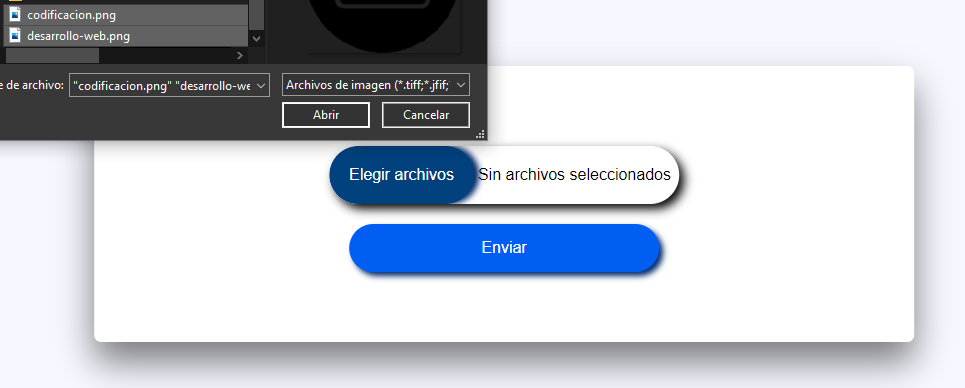

# conversión de imágenes a iconos
Este proyecto es una aplicación web que permite convertir imágenes en formato .jpg o .png a iconos en formato .ico. La aplicación está construida utilizando Flask, una librería de Python para construir aplicaciones web, y la librería PIL para la manipulación de imágenes.

## Tecnologías utilizadas
- Flask
- PIL

## Instalación
Clonar el repositorio:
```bash
git clone https://github.com/brianrscode/conversor-de-imagenes.git
```
Crear un entorno virtual:
```bash
python3 -m venv env
```
Activar el entorno virtual:
- En Windows
```bash
.\venv\Scripts\activate
```
- En Unix os MacOS:
```bash
source env/bin/activate
```

Instalar las dependencias:
```bash
pip install -r requirements.txt
```

Iniciar la aplicación:
```bash
flask --app main --debug run
```

## Uso
Abrir el navegador y dirigirse a `http://localhost:5000`.
Seleccionar una imagen en formato `.jpg` o `.png`.


Hacer clic en el botón "Enviar".
La aplicación convertirá la imagen en un icono en formato .ico y lo guardará en la carpeta `/iconos`.


***NOTA: Las imágenes que se quieren convertir a .png deben de estar en la misma carpeta del proyecto***